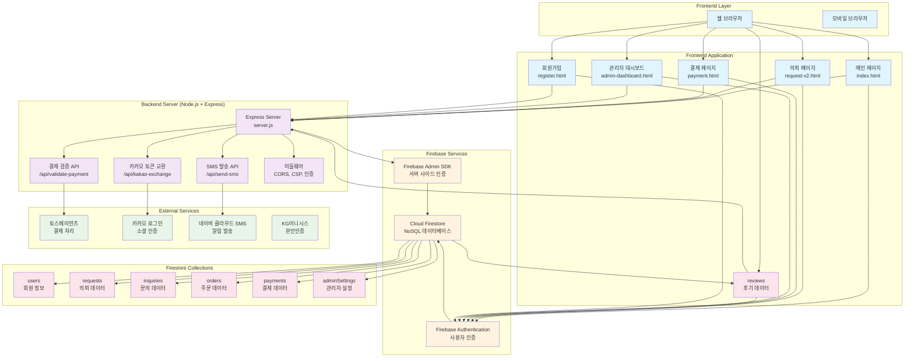
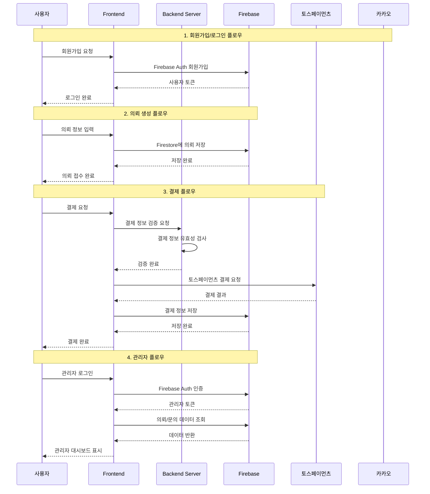
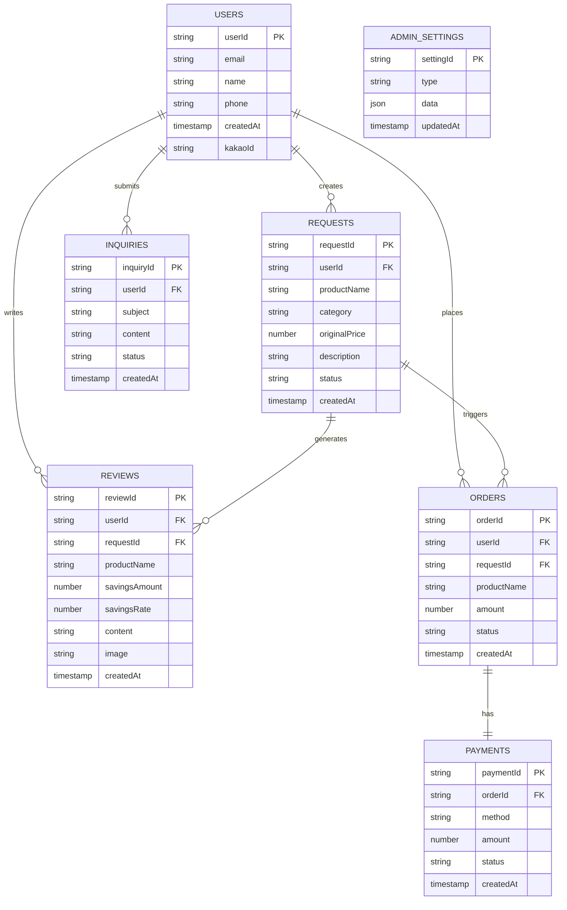
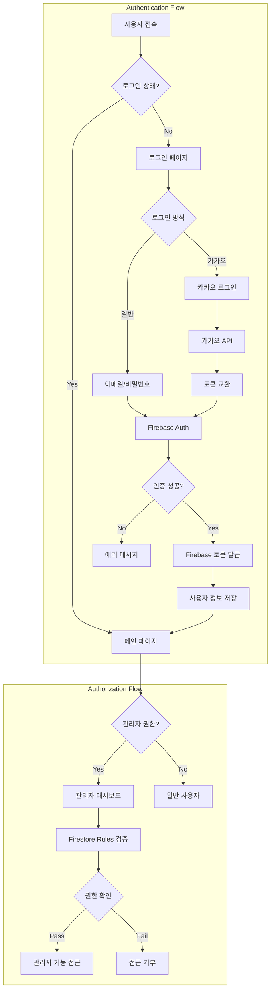

# PriceHunter 시스템 아키텍처 다이어그램

## 🏗️ 전체 시스템 구조

## 🔄 데이터 흐름 다이어그램

## 🗄️ 데이터베이스 스키마

## 🔐 보안 및 인증 플로우

## 📊 주요 API 엔드포인트

### Backend Server APIs
- `POST /api/validate-payment` - 결제 정보 검증
- `POST /api/kakao-exchange` - 카카오 토큰을 Firebase 토큰으로 교환
- `POST /api/send-sms` - SMS 알림 발송
- `GET /admin-dashboard` - 관리자 대시보드

### Firebase Services
- **Authentication**: 사용자 인증 및 토큰 관리
- **Firestore**: 실시간 데이터베이스
- **Admin SDK**: 서버 사이드 인증 및 관리

### External APIs
- **토스페이먼츠**: 결제 처리 및 웹훅
- **카카오 로그인**: 소셜 인증
- **네이버 클라우드 SMS**: 알림 발송
- **KG이니시스**: 본인인증

## 🔧 기술 스택

### Frontend
- **HTML5/CSS3/JavaScript (ES6+)**
- **Tailwind CSS** - 스타일링
- **Firebase v9 SDK** - 클라이언트 사이드 Firebase 연동

### Backend
- **Node.js + Express** - 서버 프레임워크
- **Firebase Admin SDK** - 서버 사이드 Firebase 연동
- **CORS, CSP** - 보안 미들웨어

### Database
- **Cloud Firestore** - NoSQL 실시간 데이터베이스
- **Firestore Security Rules** - 데이터 접근 제어

### External Services
- **토스페이먼츠** - 결제 처리
- **카카오 로그인** - 소셜 인증
- **네이버 클라우드 SMS** - 알림 서비스
- **KG이니시스** - 본인인증

## 🚀 배포 및 호스팅

- **Frontend**: Netlify (정적 호스팅)
- **Backend**: Vercel Functions (서버리스)
- **Database**: Firebase (Google Cloud)
- **CDN**: Netlify CDN

## 📈 모니터링 및 로깅

- **Firebase Analytics** - 사용자 행동 분석
- **Firebase Performance** - 성능 모니터링
- **Console Logging** - 서버 사이드 로깅
- **Error Tracking** - 에러 추적 및 알림

